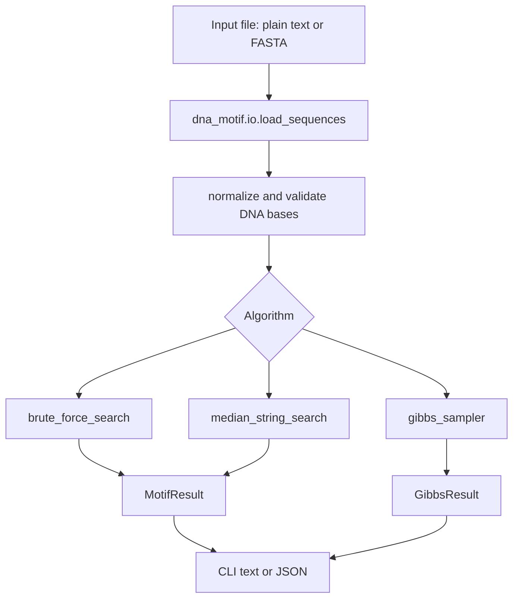

# DNA Motif Finder

A tested Python implementation of classic DNA motif discovery algorithms. The project supports exact motif search, median string search, and profile-based Gibbs sampling through both a Python API and a command-line interface.

The repository began as a notebook-only implementation. It is now structured as a maintainable package with validation, reproducible stochastic runs, sample data, tests, and developer documentation.

## What It Finds

Given a collection of DNA sequences and a motif length `k`, the project looks for short DNA patterns that are unusually well conserved across the input sequences.

For the included sample data and `k=6`:

| Algorithm | Result | Meaning |
| --- | --- | --- |
| Brute force | `GGGCAA` consensus, score `21` | Exhaustively finds the best aligned motif instances. |
| Median string | `GCAAGG` pattern, distance `3` | Finds the `k`-mer with minimum total Hamming distance to all sequences. |
| Gibbs sampler | stochastic, seedable | Uses profile-based sampling to approximate high-scoring motifs quickly. |

Brute force and median string solve different exact formulations, so ties and returned motifs can differ while still being equally optimal under their own objective.

## Repository Layout

```text
.
├── src/dna_motif/
│   ├── algorithms.py   # motif scoring, exact search, median string, Gibbs sampler
│   ├── cli.py          # dna-motif command-line interface
│   ├── io.py           # plain-text and FASTA parsing
│   └── __init__.py     # public package exports
├── tests/
│   ├── test_algorithms.py
│   └── test_io_cli.py
├── examples/
│   └── sample_sequences.txt
├── data.txt
├── DNA Motif Finding Algorithm Implementation.ipynb
├── pyproject.toml
└── README.md
```

## Architecture



Core principles:

| Area | Production behavior |
| --- | --- |
| Validation | Rejects empty input, invalid bases, invalid `k`, and impossible algorithm settings. |
| Reproducibility | Gibbs sampling accepts `--seed` and returns deterministic results for that seed. |
| Safety | Brute force has a `--max-states` guard to avoid accidental very large searches. |
| Testability | Algorithm code is pure Python and separated from CLI and file I/O. |
| Compatibility | Runs on Python `>=3.9`. |

## Installation

From the repository root:

```bash
python3 -m venv .venv
.venv/bin/python -m pip install --upgrade pip
.venv/bin/python -m pip install -e '.[dev]'
```

This installs the `dna_motif` package, the `dna-motif` CLI, and the test dependency `pytest`.

## Input Formats

Plain text, one DNA sequence per line:

```text
ACGTACGT
TGCATGCA
```

FASTA is also supported:

```text
>seq1
ACGT
ACGT
>seq2
TGCATGCA
```

Accepted bases are `A`, `C`, `G`, and `T`. Lowercase input is normalized to uppercase. Ambiguous bases such as `N` are rejected because the implemented scoring and profile models are defined over the canonical DNA alphabet.

## CLI Usage

Run Gibbs sampling, the default algorithm:

```bash
.venv/bin/dna-motif examples/sample_sequences.txt -k 6 --seed 7
```

Run exact brute force:

```bash
.venv/bin/dna-motif examples/sample_sequences.txt --algorithm brute-force -k 6 --max-states 2000000
```

Run median string search with JSON output:

```bash
.venv/bin/dna-motif examples/sample_sequences.txt --algorithm median -k 6 --json
```

Run Gibbs sampling with a short score history:

```bash
.venv/bin/dna-motif examples/sample_sequences.txt \
  --algorithm gibbs \
  -k 6 \
  --iterations 100 \
  --restarts 5 \
  --seed 7 \
  --json \
  --include-history
```

### CLI Options

| Option | Default | Applies to | Description |
| --- | ---: | --- | --- |
| `input` | required | all | Plain-text or FASTA input file. |
| `-k, --motif-length` | `6` | all | Motif length. |
| `-a, --algorithm` | `gibbs` | all | One of `brute-force`, `median`, or `gibbs`. |
| `--iterations` | `1000` | Gibbs | Iterations per restart. |
| `--restarts` | `20` | Gibbs | Number of independent Gibbs starts. |
| `--seed` | none | Gibbs | Random seed for reproducible sampling. |
| `--max-states` | `10000000` | brute force | Maximum start-position combinations allowed. |
| `--json` | off | all | Emit machine-readable JSON. |
| `--include-history` | off | Gibbs JSON | Include full Gibbs score history. |

## Python API

```python
from dna_motif import brute_force_search, gibbs_sampler, load_sequences, median_string_search

sequences = load_sequences("examples/sample_sequences.txt")

exact = brute_force_search(sequences, k=6)
median = median_string_search(sequences, k=6)
sampled = gibbs_sampler(sequences, k=6, iterations=1000, restarts=20, seed=7)

print(exact.consensus, exact.score, exact.motifs)
print(median.pattern, median.distance)
print(sampled.consensus, sampled.score)
```

## Algorithm Notes

| Algorithm | Objective | Complexity | When to use |
| --- | --- | --- | --- |
| Brute force | Maximize consensus support over one selected `k`-mer per sequence. | Product of all possible start positions. | Small datasets where an exact aligned motif solution is required. |
| Median string | Minimize total Hamming distance from a candidate `k`-mer to the closest `k`-mer in each sequence. | `4^k * sequence_count * windows_per_sequence`. | Small or moderate `k` when the median string formulation is desired. |
| Gibbs sampler | Iteratively resample motif positions from a profile built from the other sequences. | `iterations * restarts * windows_per_resampled_sequence`. | Larger inputs where exact search is too expensive and approximate search is acceptable. |

Tie policy is deterministic. Consensus ties use alphabet order `A, C, G, T`. Median string enumeration also uses that alphabet order, so the first minimum-distance pattern is returned.

## Development Workflow

Run tests:

```bash
.venv/bin/python -m pytest
```

Compile-check Python files:

```bash
.venv/bin/python -m compileall src tests
```

Validate the notebook JSON:

```bash
python3 -m json.tool "DNA Motif Finding Algorithm Implementation.ipynb" >/tmp/notebook_validated.json
```

## Verified Results

The following commands were run successfully in this repository:

| Command | Result |
| --- | --- |
| `.venv/bin/python -m pytest` | `17 passed in 6.43s` |
| `.venv/bin/python -m compileall src tests` | Python files compiled successfully. |
| `python3 -m json.tool "DNA Motif Finding Algorithm Implementation.ipynb"` | Notebook JSON validated successfully. |
| `.venv/bin/dna-motif examples/sample_sequences.txt --algorithm brute-force -k 6 --max-states 2000000` | Consensus `GGGCAA`, score `21`, states `1500625`. |
| `.venv/bin/dna-motif examples/sample_sequences.txt --algorithm median -k 6 --json` | Pattern `GCAAGG`, distance `3`, score `21`. |
| `.venv/bin/dna-motif examples/sample_sequences.txt --algorithm gibbs -k 6 --iterations 100 --restarts 5 --seed 7 --json` | Consensus `GCAAGG`, score `21`. |

## Troubleshooting

| Symptom | Cause | Fix |
| --- | --- | --- |
| `No module named pytest` | Dev dependencies are not installed. | Run `.venv/bin/python -m pip install -e '.[dev]'`. |
| `DNA input file does not exist` | The input path is wrong. | Use a path relative to the repository root or an absolute path. |
| `found: N` | Input contains ambiguous bases. | Replace or remove non-`ACGT` bases before running. |
| `motif length k exceeds the shortest sequence length` | `k` is larger than at least one sequence. | Use a smaller `k` or remove short sequences. |
| `brute force would evaluate ... states` | The exact search is too large for the configured guard. | Use Gibbs sampling, lower `k`, reduce input size, or intentionally raise `--max-states`. |

## Changelog Of Improvements

| Category | Improvement |
| --- | --- |
| Correctness | Replaced the notebook's random-position “GibbsSampling” with a real profile-based Gibbs sampler. |
| Correctness | Removed hard-coded motif length from core algorithms. |
| Correctness | Added validation for input bases, empty inputs, unequal Hamming strings, invalid `k`, and invalid stochastic parameters. |
| Reliability | Added deterministic tie policies and reproducible seeded Gibbs runs. |
| Reliability | Added a brute-force state guard to prevent accidental runaway exact searches. |
| Maintainability | Moved algorithm code into an importable `src/dna_motif` package. |
| Developer experience | Added editable packaging, a CLI entry point, sample data, `.gitignore`, and test configuration. |
| Testability | Added 17 tests covering algorithms, parsing, CLI behavior, errors, and stochastic reproducibility. |
| Documentation | Rewrote the README and updated the notebook to import the tested package instead of duplicating stale code. |

## Residual Risks

The exact algorithms are intentionally exponential and should not be used blindly on large datasets. The Gibbs sampler is approximate; a high score is likely but not guaranteed for every seed and iteration budget. Inputs with ambiguous IUPAC bases are rejected rather than modeled probabilistically.
